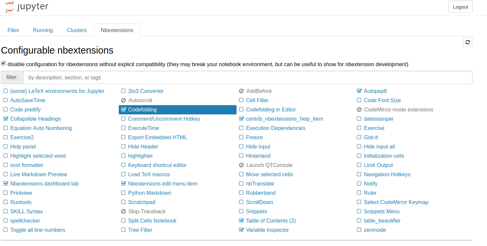

# sword-for-offer剑指offer python版代码

本代码使用jupyter进行编辑，确保安装有jupyter

推荐使用jupyter插件

安装方法：'pip install jupyter_contrib_nbextensions && jupyter contrib nbextension install'
启动jupyter Notebook 导航至新的Nbextensions选项卡，如下图：

为方便查看代码，推荐勾选图中的插件

附 [剑指offerPDF版][1]  
部分代码将在 [牛客网][2] 进行测试  

附加10大经典排序算法python版  

[1]https://pan.baidu.com/s/1pavnkxcIRgwR1sKmjosVAQ  
提取码:za5n  
[2]https://www.nowcode.com/ta/coding-interviews